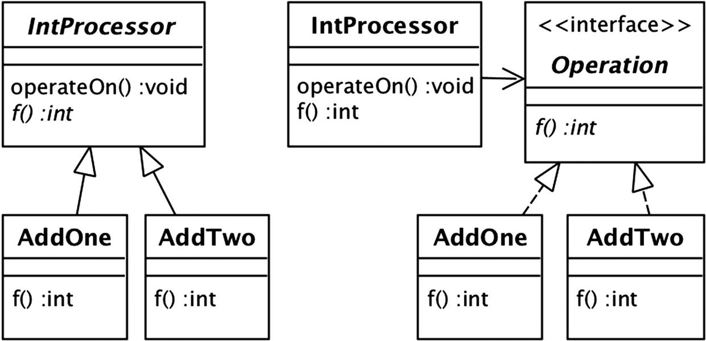

# Pattern de comportement 
Pour organiser les objets et faciliter la communication entre eux. Concernent la communication entre objets.

## Pattern Strategy

La problématique de ce pattern est plutôt simple : comment faire pour réaliser différentes opérations avec un seul et même objet ?
On pourrait dire: c’est simple on fait une classe avec toutes les opérations ! Mais non car procéder comme ceci violerait un principe SOLID : le *Single Responsibility principle* voir [Les principes SOLID](../Principes/).

Pour éviter ceci, on structure nos classes de la manière suivante :


Revenons sur le modèle "Template method". Une classe abstraite (appelée template - abstract en Java) fournit une implémentation squelettique de chaque méthode publique et s’appuie sur des méthodes abstraites non publiques pour fournir les détails propres à l’implémentation. Ces méthodes abstraites sont implémentées par les sous-classes de modèles. Chaque sous-classe est appelée classe de stratégie car elle fournit une stratégie particulière pour la mise en œuvre des méthodes abstraites du modèle.

Voici un exemple:

La classe IntProcessor est la classe "TEmlate". Il a une méthode abstraite f qui calcule une valeur de sortie à partir d'un entier donné. La méthode operateOn passe un entier à f et affiche sa valeur de sortie. Il existe deux sous-classes de stratégie, AddOne et AddTwo, qui fournissent différentes implémentations de f. La classe TestClient illustre l'utilisation de ces classes. Il crée une instance de chaque sous-classe et appelle la méthode operateOn de chaque instance.

```java
public abstract class IntProcessor {
   public void operateOn(int x) {
      int y = f(x);
      System.out.println(x + " becomes " + y);
   }
   protected abstract int f(int x);
}
public class AddOne extends IntProcessor {
   protected int f(int x) {
      return x+1;
   }
}
public class AddTwo extends IntProcessor {
   protected int f(int x) {
      return x+2;
   }
}
public class TestClient {
   public static void main(String[] args) {
      IntProcessor p1 = new AddOne();
      IntProcessor p2 = new AddTwo();
      p1.operateOn(6); // prints "6 becomes 7"      
      p2.operateOn(6); // prints "6 becomes 8"
   }
}
```
Une autre façon de concevoir ce programme consiste à ne pas utiliser de sous-class. Au lieu d'implémenter les classes de stratégie en tant que sous-classes d'IntProcessor, vous pouvez leur attribuer leur propre hiérarchie, appelée hiérarchie de stratégie. L’interface de la hiérarchie s’appelle Opération et a la méthode f. La classe IntProcessor, qui n'a plus de sous-classes ni de méthodes abstraites, contient une référence à un objet Operation et utilise cette référence lorsqu'elle doit appeler f. Voici la nouvelle implémentation. La classe TestClient crée les objets Operation souhaités et les transmet à IntProcessor via une **injection de dépendance**.

```java
public class IntProcessor {
   private Operation op;
   public IntProcessor(Operation op) {
      this.op = op;
   }
   public void operateOn(int x) {
      int y = f(x);
      System.out.println(x + " becomes " + y);
   }
   private int f(int x) {
      return op.f(x);
   }
}
interface Operation {
   public int f(int x);
}
class AddOne implements Operation {
   public int f(int x) {
      return x+1;
   }
}
class AddTwo implements Operation {
   public int f(int x) {
      return x+2;
   }
}
public class TestClient {
   public static void main(String[] args) {
      Operation op1 = new AddOne();
      Operation op2 = new AddTwo();
      IntProcessor p1 = new IntProcessor(op1);
      IntProcessor p2 = new IntProcessor(op2);
      p1.operateOn(6); p2.operateOn(6);
   }
}
```

Si vous comparez les deux exemples, vous verrez qu’elles sont des refactorisations l’une de l’autre, avec un code presque identique. La principale différence est la manière dont les classes de stratégie sont attachées à la classe IntProcessor. La figure suivante montre les diagrammes de classe correspondants pour les deux conceptions différentes.

