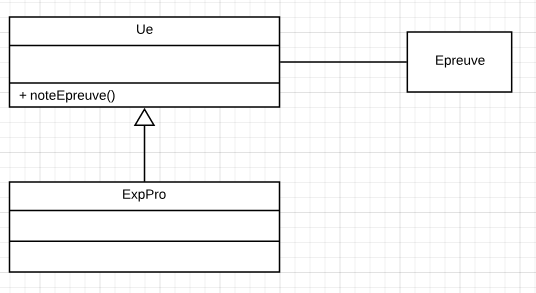

Les principes de conception orientés objet sont également appelés SOLID. Ces principes constituent un ensemble de règles pouvant être appliquées lors de la conception et du développement de logiciels, afin de créer des programmes faciles à gérer et à développer. Ils ont été introduits pour la première fois par Robert C. Martin et font partie du processus de développement logiciel agile. Les principes SOLID incluent le [principe de responsabilité unique](#ru), le [principe d'ouverture / fermeture](#of), le [principe de substitution de Liskov](#lsp), le principe de [séparation des interfaces](#isp) et le principe d'[inversion de dépendance](#dip).

# <a id="ru"></a>Principe de responsabilité unique
Le principe de responsabilité unique est un principe de conception orienté objet qui stipule qu'un module logiciel ne doit avoir qu'une seule raison de changer. Dans la plupart des cas, lors de l'écriture de code Java, nous l'appliquerons aux classes.

Le principe de responsabilité unique peut être considéré comme une bonne pratique pour optimiser l’encapsulation. Une raison de changer est quelque chose qui déclenche le besoin de changer le code. Si une classe est sujette à plus d’une raison de changer, chacune d’elles peut introduire des modifications qui affectent les autres. Lorsque ces modifications sont gérées séparément mais affectent le même module, un ensemble de modifications peut détruire la fonctionnalité liée aux autres raisons de la modification.

D'autre part, chaque responsabilité / raison de changer créera de nouvelles dépendances, rendant le code moins robuste et plus difficile à modifier.

Dans notre exemple, nous allons utiliser une base de données pour conserver les objets. Supposons que, pour la classe Ue, nous allons ajouter des méthodes pour gérer les opérations de base de données de création, lecture, mise à jour et suppression, comme indiqué dans le diagramme suivant:


Dans ce cas, l'Ue encapsulera non seulement la logique, mais également les opérations de la base de données (deux responsabilités sont deux raisons de changer). Cela rendra nos classes plus difficiles à maintenir et à tester, car le code est étroitement couplé. La classe Ue dépendra de la base de données. Par conséquent, si nous souhaitons modifier le système de base de données, nous devons modifier le code de l'Ue. Cela pourrait générer des erreurs dans la logique de l'Ue.

Inversement, la modification de la logique Ue peut générer des erreurs dans la persistance des données.

La solution créerait deux classes: l’une pour encapsuler la logique Car et l’autre pour la persistance (voir le diagramme précédent).

_Remarque: Ce principe est indépendant du fait de la modification de la structure de l'Ue (ajout ou suppression d'attribut) qui impliquerait probablement des modifications des 2 cotés. Ici on dit: Si on change la méthode d'accès à la BD on ne change pas Ue, si on change la manière de calculer le prix on ne touche pas à UeDAO..._

# <a id="of"></a>Principe ouvert / fermé

Ce principe est le suivant:

    "Les modules, les classes et les fonctions doivent être ouverts à l'extension, mais fermés à la modification."

L'application de ce principe nous aidera à développer un logiciel complexe et robuste. Nous devons imaginer que le logiciel que nous développons construit une structure complexe. Une fois que nous en avons terminé une partie, nous ne **devrions plus la modifier** mais **la construire par-dessus**.

Lors du développement d'un logiciel, c'est la même chose. Une fois que nous avons développé et testé un module, si nous voulons le modifier, nous devons tester non seulement les fonctionnalités que nous modifions, mais également l’ensemble des fonctionnalités dont il est responsable _(test de régression)_. Cela implique beaucoup de ressources supplémentaires, qui n'ont peut-être pas été estimées dès le début, et qui peuvent également engendrer des risques supplémentaires. Les modifications apportées à un module peuvent affecter les fonctionnalités des autres ou de l’ensemble. Il faut revoir toutes les dépendances, un travail colossale!


Pour cette raison, il est recommandé d'essayer de conserver les modules inchangés une fois l'opération terminée et d'ajouter de nouvelles fonctionnalités en les étendant à l'aide de l'héritage et du polymorphisme _(à titre personnel je n'utilise l'héritage que pour ces cas précis)_. Le principe d'ouverture / fermeture est l'un des principes de conception les plus importants en tant que base de la plupart des modèles de conception.

# <a id="lsp"></a>Principe de substitution de Liskov
Barbara Liskov déclare que, les types dérivés doivent être complètement substituables à leurs types de base. Le principe de substitution de Liskov (LSP) est fortement lié au polymorphisme de sous-typage. Sur la base du polymorphisme de sous-typage dans un langage orienté objet, un objet dérivé peut être remplacé par son type parent. Par exemple, si nous avons un objet "Ue", il peut être utilisé dans le code en tant que "ConstituantDiplôme".

Le LSP indique que, lors de la conception des modules et des classes, nous devons nous assurer que les types dérivés sont substituables du point de vue du comportement. Lorsque le type dérivé est remplacé par son sur-type, le reste du code fonctionnera comme il est le sous-type. De ce point de vue, le type dérivé devrait se comporter comme son supertype et ne devrait pas altérer son comportement. Cela s'appelle un sous-typage comportemental fort.

Pour comprendre le LSP, prenons un exemple dans lequel le principe est violé. Pendant que nous travaillons sur le logiciel de service de diplôme, nous découvrons que nous devons modéliser le scénario suivant. Lorsqu'une Ue  doit être réussi, l'auditeur doit passer un examen. L'assistant de service organise l'examen et, lorsque l'auditeur passe son examen, il vérifie qu'il a la bonne composition et qu'il a corrigé la bonne épreuve. Il va simplement la référencé, puis la transmet au correcteur.

Nous avons déjà défini une classe Ue. Nous créons maintenant une classe Épreuve et ajoutons une méthodes à la classe Ue: passerExamen.

En travaillant sur notre logiciel, nous réalisons que les Evaluations de l'experience professionnelle sont semblable aux Ue (elle possède des crédits). Comme mous considérons que les "experience professionnelle" sont des Ue spéciales, nous créons une classe ExpPro, héritée de l'Ue:



Le problème est qu'une évaluation d'expérience n'à pas d'épreuve ni de notes! 

donc on contournerais le problème (par exemple) en écrivant du code impropre

```java
public Integer noteEpreuve(...) {
    throw Exception...("Il n'y a pas d'examen pour l'expérience professionnelle");
}
```

L'anti-principe: Nous concevons notre logiciel de manière à ce qu'il fonctionne avec des Ue, qu'il s'agisse ou non d'"experience professionnelle". Nous pourrions donc, à l'avenir, l'étendre à d'autres types d'Ue. Un problème peut provenir du fait que les Ues ont des épreuves et des notes! et pas leur extensions.

# <a id="isp"></a>Principe de séparation des interfaces

Pour exposé des services d'un module (ou d'une classe) il est commun de séparer l'interface de l'implémentation. Mais faut respecter  le principe de séparation des interfaces

la citation et l'exemple est issue de https://www.oodesign.com/interface-segregation-principle.html

    "Les clients ne doivent pas être obligés de dépendre d'interfaces qu'ils n'utilisent pas."

Lorsqu'il est appliqué, le principe de ségrégation d'interface (ISP) réduit le couplage de code, rendant le logiciel plus robuste et plus facile à maintenir et à étendre. L'ISP a été annoncé par Robert Martin, quand il s’est rendu compte que si le principe était brisé et que les clients étaient obligés de dépendre d’interfaces qu’ils n’utilisaient pas, le code était tellement couplé qu’il était presque impossible d’ajouter de nouvelles fonctionnalités.

Afin de mieux comprendre cela, analysons l'exemple


Voici la solutions en appliquant le principe


Si la conception est déjà terminée, les _grosses_ interfaces peuvent être séparées à l’aide du modèle de conception d’adaptateur (TODO ref).

Comme chaque principe, le principe de séparation des interfaces est un principe qui nécessite du temps et des efforts supplémentaires pour l'appliquer pendant le temps de conception et accroître la complexité du code. Mais cela produit un conception flexible. Si nous voulons l'appliquer plus que nécessaire, il en résultera un code contenant de nombreuses interfaces avec des méthodes uniques. L'application doit donc être effectuée en fonction de l'expérience et du bon sens pour identifier les domaines dans lesquels l'extension du code est plus susceptible de se produire à l'avenir.

# <a id="dip"></a>Principe d'inversion de dépendance

    "Les modules de haut niveau ne devraient pas dépendre de modules de bas niveau. Les deux devraient dépendre d'abstractions."

    "Les abstractions ne devraient pas dépendre des détails. Les détails devraient dépendre des abstractions."

Pour comprendre ce principe, nous devons expliquer l’important concept de couplage et de découplage. Le couplage indique dans quelle mesure les modules d’un logiciel sont dépendants les uns des autres. Plus la dépendance est faible, plus il est facile de maintenir et d'étendre le système et planifier le travail.

Il existe différentes approches pour découpler les composants d'un système, (voir TODO ref). L'une d'entre elles consiste à séparer la logique de haut niveau des modules de bas niveau, comme indiqué dans le schéma suivant (en fait on utilise les interfaces qui sont l'abstraction ou le type de haut niveaux).